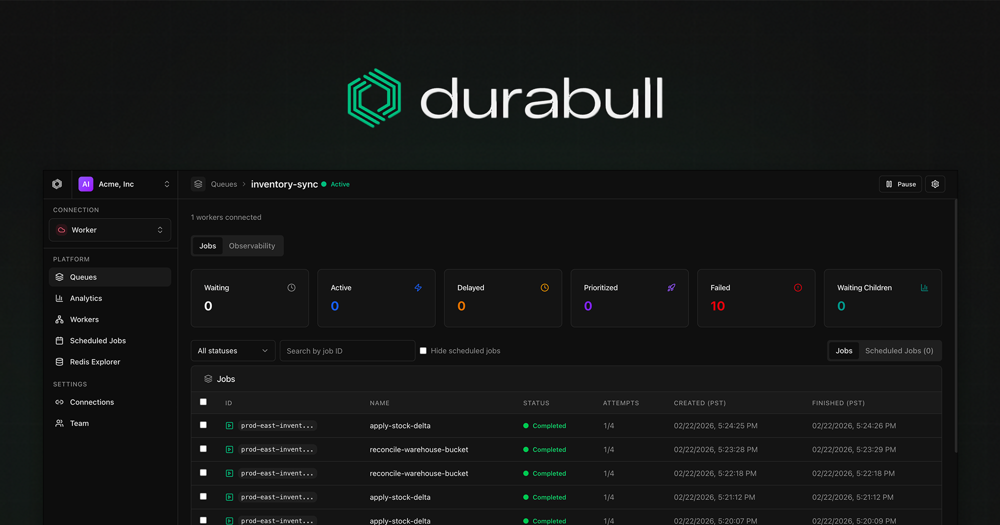

<p align="center">
  
</p>

<div align="center">
  <h1>Durabull</h1>
  <p><strong>The modern dashboard for BullMQ.</strong></p>
  <p>Monitor queues, inspect jobs, debug failures, and operate workers across Redis environments.</p>
  <p>
    <a href="https://durabull.io/documentation"><strong>Documentation</strong></a>
    <span> · </span>
    <a href="https://durabull.io"><strong>Hosted Product</strong></a>
  </p>
</div>

## Project

Durabull is an open-source BullMQ operations platform built for teams that need visibility and control over background jobs.

- Queue and job visibility across multiple Redis connections
- Worker and scheduler diagnostics
- Redis key exploration tailored for BullMQ patterns
- Local-first development with Bun + TypeScript in a monorepo

## Run locally

### Prerequisites

- Bun `1.3+`
- Redis (local or remote)

### Fastest path (authless)

```bash
bun install
bun run dev:authless
```

Open:

- Web: `http://localhost:5173`
- API: `http://localhost:3001/api`

> `dev:authless` is for local/private environments. Do not expose authless mode directly to the public internet.

### Full local stack (Postgres + Redis + seeded data)

```bash
bun docker
bun docker:seed
bun run dev
```

## Helpful links

- Docs home: [`https://durabull.io/documentation`](https://durabull.io/documentation)
- Local development: [`/documentation/getting-started/local-development`](https://durabull.io/documentation/getting-started/local-development)
- Installation: [`/documentation/self-hosting/installation`](https://durabull.io/documentation/self-hosting/installation)
- Environment variables: [`/documentation/getting-started/environment-variables`](https://durabull.io/documentation/getting-started/environment-variables)
- HTTP API reference: [`/documentation/reference/http-api`](https://durabull.io/documentation/reference/http-api)

## Anonymous usage telemetry

Production and self-hosted Durabull collects anonymous/pseudonymous usage telemetry to understand
feature usage and improve the product. Configuring `POSTHOG_KEY` for your own PostHog project does
not disable Durabull telemetry, and Durabull does not provide a product-level telemetry opt-out.
When `POSTHOG_KEY` is set, the configured PostHog project still receives the full PostHog browser
analytics stream.

Durabull does not collect Redis URLs, queue names, Redis key names, job data, logs, emails, names,
organizations, hostnames, raw URLs, search patterns, stack traces, or raw error messages.

## Useful repo guides

- Desktop build and release guide: [`apps/desktop/README.md`](apps/desktop/README.md)
- Authentication package: [`packages/auth/README.md`](packages/auth/README.md)
- Fleet demo workload: [`packages/fleet-demo-workload/README.md`](packages/fleet-demo-workload/README.md)
- Example environment config: [`.env.example`](.env.example)

## Monorepo at a glance

- `apps/api` - Bun + Hono API
- `apps/web` - React dashboard app
- `apps/docs` - Next.js documentation site
- `packages/*` - shared auth, DAL, analytics, utilities, and demo workload packages

## License

Elastic License 2.0 (ELv2). See [`LICENSE`](LICENSE).
