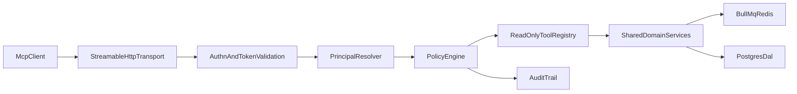

# MCP Implementation Master Plan (Technical Blueprint)

## Purpose

Define **how** to implement Durabull's hosted MCP server end-to-end, with concrete architecture, auth/tokening, permission boundaries, tool contracts, and validation strategy.

This document is the technical source of truth for implementation details.  
Use `tasks/mcp-pr-execution-playbook.md` for sequencing and handoff execution.

---

## Agent Startup Checklist (Mandatory)

Every incoming agent must complete this before writing code.

### A) Context Sync

- [ ] Read this entire file: `tasks/mcp-implementation-master-plan.md`.
- [ ] Read execution sequencing file: `tasks/mcp-pr-execution-playbook.md`.
- [ ] Open the active PR record in the playbook ledger and confirm current PR target.
- [ ] Confirm branch is the intended PR branch and based on latest `main`.
- [ ] Confirm whether a Linear issue is linked for the active PR.

### B) Scope Lock

- [ ] Copy the active PR section's objective and exit criteria into working notes.
- [ ] List exactly which checklist items are in-scope for this PR.
- [ ] List explicitly out-of-scope items and defer them.
- [ ] Confirm no phase-2 write/destructive MCP tools are being introduced.

### C) Security Lock

- [ ] Verify auth assumptions (Better Auth base + OAuth scoped bearer for MCP).
- [ ] Verify tenant boundary requirements (org + connection checks on every op).
- [ ] Verify least-privilege scope requirements for each touched tool/path.
- [ ] Identify and include at least one negative auth/authz test for the PR.

### D) Validation Lock

- [ ] Define required test commands before coding.
- [ ] Define specific evidence to attach in PR description.
- [ ] Define rollback or mitigation for the changed area.

---

## First 10 Steps (Deterministic Startup Runbook)

1. Identify active PR ID from `tasks/mcp-pr-execution-playbook.md`.
2. Copy PR objective + deliverables + tests into scratch notes.
3. Run `git status --short --branch` and verify correct branch/upstream.
4. Diff against `main` to understand current stack context.
5. Read all files listed under the active PR's File Targets.
6. Trace touched codepaths for auth, org scope, connection scope, and redaction.
7. Write a mini test matrix (happy path + denial path + boundary path).
8. Implement smallest vertical slice that satisfies one deliverable completely.
9. Run tests/lint/typecheck for touched packages and capture outputs.
10. Update playbook ledger entry with what changed + evidence + handoff notes.

If any step cannot be completed, mark PR status as `blocked` in the ledger and document why.

---

## Anti-Drift Protocol

Use this protocol to prevent agents from diverging from intended scope.

### Drift Triggers

Treat these as drift and stop to re-scope:

- touching files outside active PR scope without justification
- introducing write/destructive capability in phase 1
- adding new scopes not defined in this plan without design update
- skipping negative auth/authz tests
- changing architecture boundaries ad hoc (route-coupled MCP logic)

### Drift Response

When drift is detected:

1. Stop coding.
2. Record drift in playbook ledger under current PR.
3. Re-map work to active PR checklist items.
4. Move true overflow work to next PR's handoff notes.
5. Resume only after scope is back inside PR boundaries.

---

## 1) Product Scope and Guardrails

### 1.1 Phase 1 Product Surface

Ship a remote, hosted MCP server that supports read-only diagnostics:

- jobs
- failures
- logs
- stacktraces
- queue metrics
- worker state
- composed failure explanation

No mutation tools in phase 1.

### 1.2 Hard Guardrails

- No destructive tool registration in phase 1.
- Read-only mode enforced in code and config.
- Per-request authz required on every MCP request.
- Tenant boundary checks (org + connection) on every domain operation.

---

## 2) Current System Reuse Strategy

### 2.1 Reuse Existing Durabull Domain Logic

Durabull already implements job/failure/log operations in API and BullMQ layers:

- `apps/api/src/routes/jobs.ts`
- `apps/api/src/routes/queues.ts`
- `apps/api/src/lib/bullmq-metrics.ts`
- `apps/api/src/lib/alert-monitor.ts`
- `apps/api/src/lib/alert-notifier.ts`
- DAL alert repositories in `packages/dal/src/repositories/*`

### 2.2 Extraction/Adapter Plan

Avoid coupling MCP to HTTP route handlers. Extract shared logic into a reusable service layer (or adapters) consumed by both API and MCP:

- `packages/mcp-domain` (new) or `apps/api/src/lib/domain/*` (intermediate)
- Inputs are typed DTOs, not Hono contexts
- Outputs are typed objects with normalized errors

Target interfaces:

- `QueueReadService`
- `JobReadService`
- `FailureReadService`
- `DiagnosticsService`

---

## 3) Target Runtime Architecture

### 3.1 Service Placement

- New deployable service: `apps/mcp`
- Independent process + scaling profile
- Shared packages for domain and auth primitives

### 3.2 Why Separate Service

- Isolates protocol/security concerns from public API routing
- Enables dedicated rate limits and auth behavior
- Supports cloud/self-host rollout independently

---

## 4) MCP Protocol and Transport Implementation

## 4.1 SDK/Transport Choice

- Use official MCP TypeScript SDK streamable HTTP support
- Support `GET` and `POST` MCP endpoints
- Start with stateful transport if resumability is needed; otherwise stateless

### 4.2 Required HTTP Security Behavior

- Host header validation enabled
- Strict CORS allowlist (no wildcard with credentials)
- Request size limits
- Timeouts and cancellation propagation

### 4.3 Required MCP Capability Surface

- `tools/list`
- `tools/call`
- `resources/list` (optional phase 1)
- `resources/read` (optional phase 1)

Do not expose prompts/sampling unless explicitly needed.

---

## 5) Authentication and Tokening Model

## 5.1 Identity Foundation

Use existing Better Auth (`better-auth`) for:

- user identity
- org membership context
- session lifecycle

Layer OAuth 2.1 token-based auth for MCP remote transport.

### 5.2 Token Classes

1. Delegated user tokens
   - principal: user
   - org context: asserted and verified
2. Service account tokens
   - principal: machine/service account
   - org-scoped
   - explicit scope bindings

### 5.3 OAuth/MCP Compliance Requirements

- Protected Resource Metadata (RFC9728)
- `WWW-Authenticate` challenge with resource metadata discovery
- Authorization Server Metadata (RFC8414)
- Authorization Code + PKCE (for delegated user clients)
- Resource Indicators (RFC8707) in auth/token requests
- audience/resource validation on every token

### 5.4 Token Validation Rules (Per Request)

- signature/issuer valid
- token not expired/revoked
- audience/resource matches MCP server canonical URI
- required scope present
- principal and org active

Failure semantics:

- `401` for missing/invalid token
- `403` for insufficient scope/permissions

---

## 6) Authorization and Policy Engine

## 6.1 Authorization Layers

1. Transport auth (bearer token)
2. Principal resolution
3. Scope check (tool-level)
4. Org membership check
5. Connection ownership check
6. Optional field-level redaction policy

### 6.2 Scope Taxonomy (Phase 1)

- `mcp:discover`
- `mcp:jobs:read`
- `mcp:failures:read`
- `mcp:logs:read`
- `mcp:diagnostics:read`

Reserved for phase 2 write controls:

- `mcp:jobs:retry`
- `mcp:jobs:remove`
- `mcp:queues:pause`
- `mcp:queues:purge`

### 6.3 Policy Decision Contract

Each tool call produces a decision record:

- principal id/type
- org id
- connection id
- tool name
- required scopes
- granted/denied
- denial reason
- correlation id

---

## 7) Data Model Additions (DAL)

Add tables/entities for machine auth and policy:

- `mcp_service_account`
- `mcp_service_account_secret` (hash only, never plaintext storage)
- `mcp_policy_binding` (principal->scopes/tools constraints)
- `mcp_token_revocation` (if opaque token strategy)
- `mcp_audit_event`

Rules:

- secrets hashed with modern password/hash strategy
- rotation supported
- revocation immediate on disabled principal
- all records org-scoped

---

## 8) MCP Tool Catalog (Phase 1) and Contracts

All tools require:

- strict Zod input schema
- bounded pagination
- normalized error envelope
- read-only annotations

### 8.1 Tool: `list_connections`

Input:

- `cursor?`
- `pageSize?` (max 100)

Output:

- list of accessible connection descriptors (no secret URLs)
- next cursor

### 8.2 Tool: `list_queues`

Input:

- `connectionId`
- `cursor?`, `pageSize?`

Output:

- queue names + status counts

### 8.3 Tool: `get_queue`

Input:

- `connectionId`
- `queueName`

Output:

- queue detail + count summary + pause state

### 8.4 Tool: `list_jobs`

Input:

- `connectionId`
- `queueName`
- filters: `status?`, `name?`, `jobId?`
- pagination

Output:

- normalized job summary list

### 8.5 Tool: `get_job`

Input:

- `connectionId`
- `queueName`
- `jobId`

Output:

- full safe job detail

### 8.6 Tool: `get_job_logs`

Input:

- `connectionId`, `queueName`, `jobId`
- `cursor?`, `pageSize?` max 100

Output:

- ordered log lines + pagination token

### 8.7 Tool: `get_job_stacktraces`

Input:

- `connectionId`, `queueName`, `jobId`
- pagination

Output:

- attempt-indexed stacktrace entries

### 8.8 Tool: `get_failure_events`

Input:

- `connectionId`
- optional `queueName`, `jobId`, `status`
- offset/limit

Output:

- alert/failure event records with safe context

### 8.9 Tool: `get_queue_metrics`

Input:

- `connectionId`, `queueName`
- optional `windowMinutes`

Output:

- completed/failed windows, rates, streaks

### 8.10 Tool: `get_workers`

Input:

- `connectionId`
- optional queue filter

Output:

- worker snapshots

### 8.11 Tool: `explain_job_failure`

Input:

- `connectionId`, `queueName`, `jobId`

Output:

- composed narrative:
  - failed reason
  - attempt timeline
  - top signal from stacktrace/logs
  - alert context linkage
  - confidence flags

Implementation note:

- Deterministic summary, not LLM-dependent.
- Keep summary traceable back to source fields.

---

## 9) Redaction and Data Safety

### 9.1 Redaction Policy

Never return:

- Redis URLs/secrets
- known credential patterns in logs
- unsafe raw payload fields when policy marks as sensitive

Return:

- redacted placeholders
- redaction metadata count for transparency

### 9.2 Sensitive Field Strategy

- Central sanitizer utility
- Shared denylist + optional per-tool allowlist
- snapshot tests for redaction regressions

---

## 10) Reliability and Operational Controls

### 10.1 Rate Limits

- per principal
- per tool
- burst + sustained windows
- shared backend (not in-memory only) for multi-replica deployments

### 10.2 Timeouts and Backpressure

- per tool timeout budgets
- server-side cancellation if client disconnects
- bounded concurrent calls per principal

### 10.3 Observability

- structured logs with correlation ids
- metrics:
  - auth failures
  - policy denies
  - tool latency/error rates
  - redaction counts

### 10.4 Audit Trail

Audit event on every tool call:

- who
- what tool
- resource target
- decision
- input hash
- response class

---

## 11) Cloud and Self-Hosted Deployment

## 11.1 Cloud Hosted

- dedicated MCP service deployment
- managed secrets
- HTTPS ingress
- autoscaling + shared rate-limit backend

### 11.2 Self-Hosted

- enable MCP service via env flags
- default read-only mode on
- explicit operator opt-in for future write scopes
- hardening guidance:
  - TLS
  - private network placement
  - secret rotation cadence

---

## 12) Test Strategy and Quality Gates

## 12.1 Unit Tests

- scope matching
- policy decision logic
- sanitizer/redaction behavior
- DTO validation

### 12.2 Integration Tests

- MCP transport lifecycle
- OAuth discovery and challenge flow
- authorized read tool calls
- forbidden cross-org calls

### 12.3 Security Tests

- wrong audience token rejected
- missing scope rejected with correct semantics
- revoked principal rejected
- token replay/expiry behavior

### 12.4 Performance Tests

- log-heavy pagination
- stacktrace retrieval
- concurrent read tool traffic

### 12.5 Acceptance Gate

Do not mark phase complete until:

- all tests green
- no critical/high open security findings
- staging smoke passes for delegated + service-account flows

---

## 13) Implementation Order (Technical Dependency Graph)

1. establish `apps/mcp` runtime and MCP transport
2. implement auth discovery and token validation middleware
3. add principal resolver + policy engine
4. extract/shared domain service adapters
5. ship read tools incrementally
6. add redaction + rate limiting + audit
7. deployment + runbooks + final compliance verification

---

## 14) Explicit Non-Goals (Phase 1)

- no destructive tool support
- no arbitrary Redis key read/delete via MCP
- no automatic remediation actions
- no broad wildcard scopes

---

## 15) Delivery Sign-Off Checklist

- [ ] MCP transport spec behavior validated
- [ ] OAuth/resource audience validation enforced
- [ ] least-privilege scopes implemented
- [ ] org and connection boundary checks enforced
- [ ] tool outputs sanitized/redacted
- [ ] audit logging operational
- [ ] cloud and self-host docs complete
- [ ] sequential PR playbook updated with actual PR links/status
